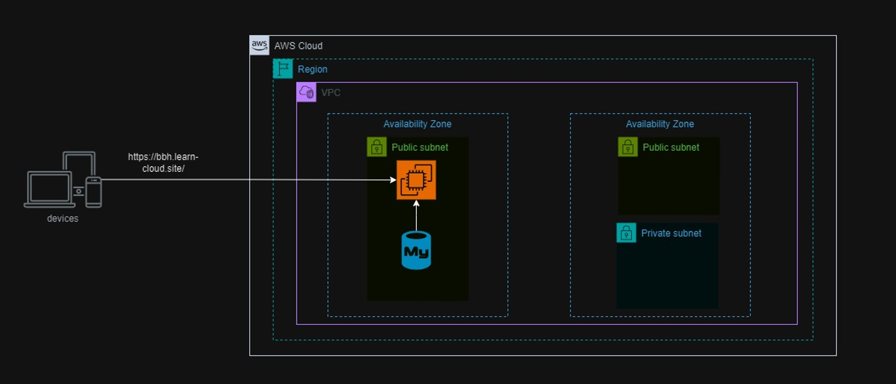
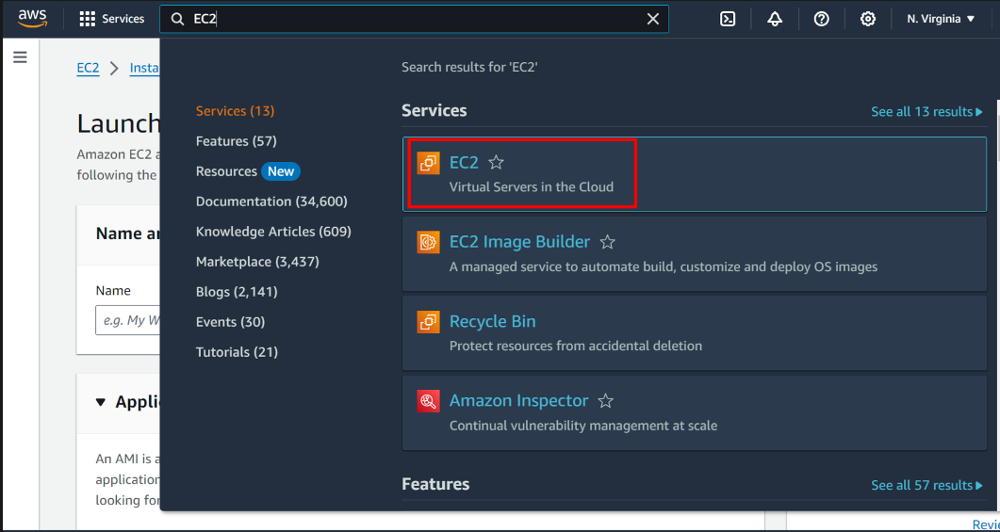
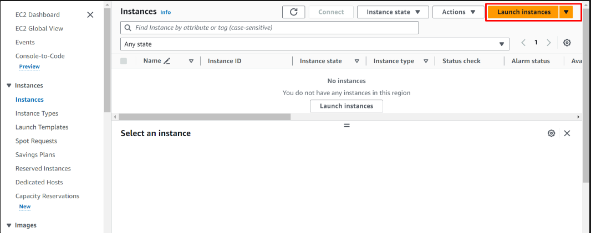
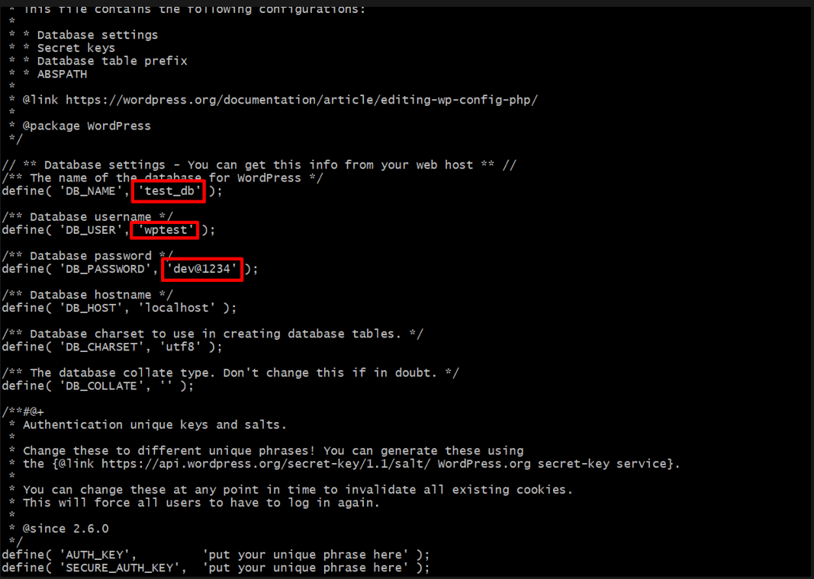
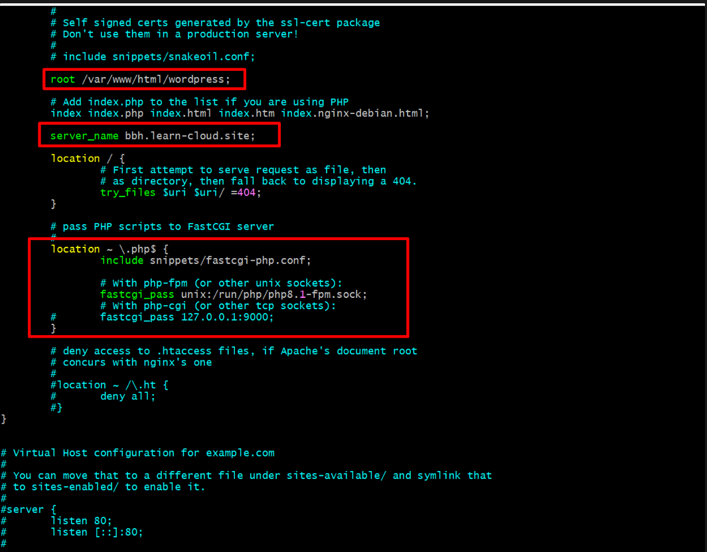
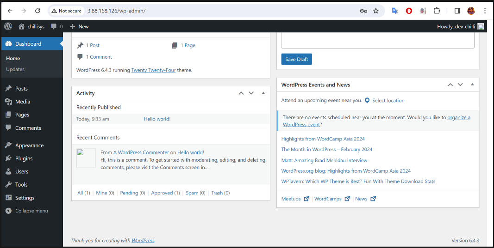
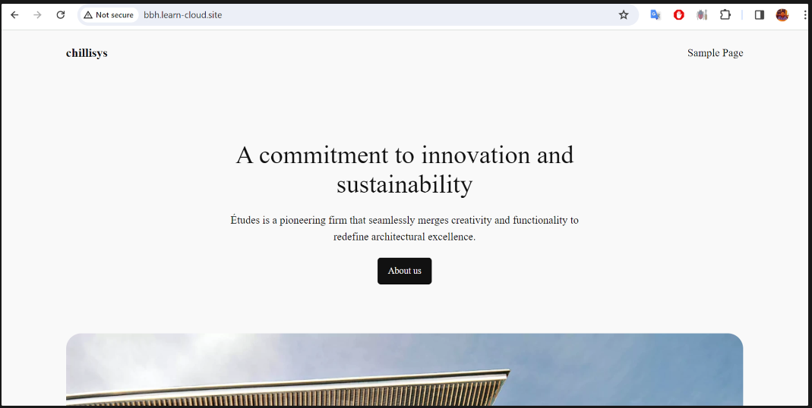

# Setup-WordPress-on-EC2
Setting Up WordPress on EC2 Instance




Setting Up WordPress on EC2 Instance architecture diagram.

##  Prerequisites
- EC2 Insatnce
- Wordpress template
- PHP
- MySQL
- Nginx


## Create an EC2 Instance for the setup.

Login to your AWS account or create a new one for free.

Select the EC2 service in the console.




On the “EC2 Dashboard” select “Launch Instance”.




## Download and Install WordPress on EC2 Instance.

Go to /var/www/html using following command.


```bash
cd /var/www/html
```


Download wordpress template


```bash
sudo wget -c http://wordpress.org/latest.tar.gz
```

Extract files using the tar command


```bash
sudo tar -xzvf latest.tar.gz

ls -al
```

Modify the file ownership and configure the necessary permissions accordingly


```bash
sudo chown -R www-data:www-data /var/www/html/WordPress
```

## Create and Configure Database in Mysql for WordPress

Log into MySQL root account

```bash
sudo mysql -u root -p
```

Create database name as test_db


```SQL
CREATE DATABASE test_db; --you can give any name to your database here
```

Create user.

```SQL
CREATE USER wptest@localhost IDENTIFIED BY 'dev@1234'; -- you can give any username name here and password
Now you just created a new user  here
```

Give permission allow.

```SQL
GRANT ALL PRIVILEGES ON test_db. * TO wptest@localhost;
```

Activate the database permission.

```SQL
FLUSH PRIVILEGES;
exit;
```

Give the wordpress directory to full permission.


```bash
sudo chmod -R 777 wordpress/

ls -al

cd wordpress/

```

Copy and rename to wp-config-sample.php to wp-config.php


```bash
cp wp-config-sample.php wp-config.php
```

Edit wp-config.php 

```bash
nano wp-config.php
```


Define DB_NAME, DB_USER, DB_PASSWORD.




Insatll nginx and php services


```bash
apt-get install nginx mariadb-server php php-curl php-mysql php-gd php-intl php-mbstring php-soap php-xml php-xmlrpc php-zip php-fpm -y
```


Go to /etc/nginx/sites-available and edit with vim default
We are use default file to config for this lab.





Reload Nginx service

```bash
sudo systemctl reload nginx
```

Test URL: http://3.88.168.126/wp-admin/   (Use with EC2 public IP)





Access URL link with domain name. (Domain point are need to do in DNS setting of domain management)




